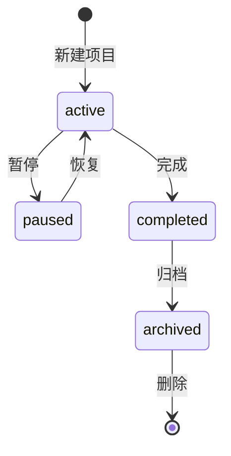
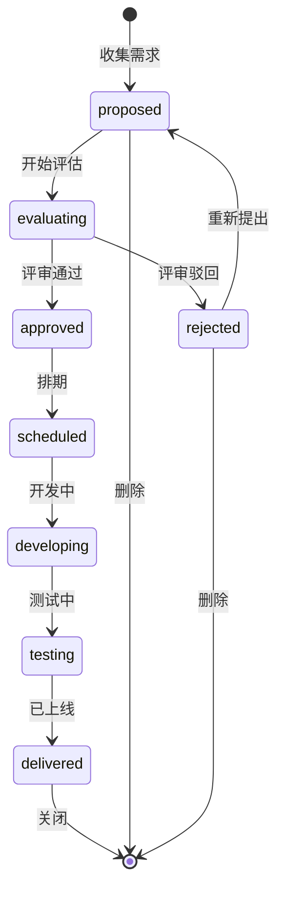

# 产品经理 · 个人工作台功能设计

***

## 文档信息

| 项目 | 内容 |
| ---- | -------------------- |
| 文档编号 | PM-WORKBENCH-PRD-2026-001 |
| 文档版本 | v0.1 |
| 产品名称 | 产品经理个人工作台 |
| 所属系统 | 独立 Web 应用 |
| 编制日期 | 2026-03-15 |
| 编制人员 | 产品经理 |

### 修订记录

| 版本 | 修订日期 | 修订说明 | 修订人 |
| ---- | -------------- | ---- | ------ |
| v0.1 | 2026-03-15 | 初稿创建 | 产品经理 |

***

## 一、产品概述

### 1.1 产品定位

个人工作台是一款面向产品经理个人的一站式效率工具，集任务管理、日程安排、项目管理、知识库、复盘总结五大核心功能于一体，帮助产品经理在日常工作中高效管理待办事项、规划时间、跟踪项目进度、沉淀知识资产、周期性复盘总结。

### 1.2 目标用户

- **主要用户：** 产品经理本人
- **使用场景：** 日常工作规划、任务跟进、项目进度追踪、知识沉淀、周期复盘

### 1.3 产品目标

| 目标 | 说明 |
| ---- | ---- |
| 统一工作入口 | 将分散在多个工具（待办清单、日历、笔记、项目文档）中的信息整合到单一平台 |
| 提升工作效率 | 通过快捷操作、键盘快捷键、智能提醒等方式减少操作成本 |
| 知识沉淀 | 提供便捷的笔记和知识库功能，让经验可积累、可检索 |
| 数据驱动复盘 | 基于任务完成数据自动生成统计报表，辅助周期性复盘 |

### 1.4 角色权限

本产品为个人工具，仅一个用户角色，无多角色权限体系。所有功能操作对用户完全开放。

***

## 二、模块路径

个人工作台采用单页应用（SPA）架构，通过侧边栏导航切换各功能模块：

```
首页(仪表盘) → 任务管理 → 日程安排 → 项目管理 → 需求管理 → 知识库 → 复盘总结
```

***

## 三、核心功能模块

### 3.1 功能总览

| 序号 | 模块名称 | 功能描述 | 优先级 |
| :--: | ------- | -------- | :----: |
| 1 | 首页仪表盘 | 展示今日任务、待办统计、近期日程、项目进度、快捷操作入口 | P0 |
| 2 | 任务管理 | 任务的创建、编辑、删除、状态流转、标签分类、优先级管理、看板/列表视图 | P0 |
| 3 | 日程安排 | 日历视图（月/周/日）、事件创建与管理、时间块规划、提醒通知 | P0 |
| 4 | 项目管理 | 项目创建与管理、看板视图、里程碑设置、进度统计、项目归档 | P0 |
| 5 | **需求管理** | 用户需求收集、需求池管理、需求评审、优先级排序、需求跟踪 | P0 |
| 6 | 知识库 | 笔记创建（Markdown）、文件夹/标签分类、全文搜索、笔记关联 | P0 |
| 7 | 复盘总结 | 日报/周报/月报自动生成、任务完成统计、趋势分析、手动复盘笔记 | P0 |

### 3.2 模块一：首页仪表盘

#### 3.2.1 功能描述

作为用户登录后的默认首页，以卡片式布局集中展示关键信息概览，帮助用户快速掌握当日工作全貌。

#### 3.2.2 页面布局

```
┌─────────────────────────────────────────────────────────────────┐
│  顶部导航栏（Logo | 全局搜索 Cmd+K | 设置 | 主题切换）              │
├──────────┬──────────────────────────────────────────────────────┤
│          │  ┌──────────────┐ ┌──────────────┐ ┌──────────────┐  │
│  侧边栏   │  │ 今日待办      │ │ 进行中任务    │ │ 今日日程      │  │
│          │  │ 5个待办      │ │ 3个进行中    │ │ 2个日程      │  │
│  ☐ 首页   │  └──────────────┘ └──────────────┘ └──────────────┘  │
│  ☐ 任务   │  ┌──────────────────────────────────────────────┐  │
│  ☐ 日程   │  │ 项目进度概览                                     │  │
│  ☐ 项目   │  │ [项目A ████████░░ 80%]                        │  │
│  ☐ 知识库  │  │ [项目B ██████░░░░ 60%]                        │  │
│  ☐ 复盘   │  │ [项目C ████░░░░░░ 40%]                        │  │
│          │  └──────────────────────────────────────────────┘  │
│          │  ┌──────────────┐ ┌──────────────┐                │
│          │  │ 近期截止任务   │ │ 快捷笔记      │                │
│          │  │ · 需求评审 明天│ │ [写点什么...] │                │
│          │  │ · 原型评审 周5│ └──────────────┘                │
│          │  └──────────────┘                                  │
└──────────┴─────────────────────────────────────────────────────┘
```

#### 3.2.3 组件说明

| 组件 | 内容 | 交互说明 |
| ---- | ---- | -------- |
| 今日待办卡片 | 展示待办状态的任务数量及列表 | 点击跳转至任务管理模块，并自动筛选今日待办 |
| 进行中任务卡片 | 展示进行中状态的任务数量及列表 | 点击跳转至任务管理-看板视图 |
| 今日日程卡片 | 展示今日日程事件列表 | 点击跳转至日程安排-今日视图 |
| 项目进度概览 | 展示活跃项目的名称和进度条 | 点击跳转至对应项目详情 |
| 近期截止任务 | 展示未来3天内截止的任务列表 | 按截止日期升序排列，已逾期红色标记 |
| 快捷笔记 | 快速输入框，支持即刻记录想法 | 输入后自动保存为知识库笔记，默认放到"快捷笔记"文件夹 |

### 3.3 模块二：任务管理

#### 3.3.1 功能描述

任务管理是工作台的核心模块，提供全生命周期的任务管理能力，支持看板视图和列表视图切换。

#### 3.3.2 状态流转

```mermaid
stateDiagram-v2
    [*] --> todo: 新建任务
    todo --> in-progress: 开始处理
    in-progress --> done: 完成
    done --> todo: 重新打开
    todo --> [*]: 删除
    in-progress --> [*]: 删除
```

#### 3.3.3 页面布局

**列表视图：**

```
┌─────────────────────────────────────────────────────────────────┐
│  任务管理                                          [看板视图] [列表视图] │
├─────────────────────────────────────────────────────────────────┤
│  ┌─────────────────────────────────────────────────────────┐    │
│  │ 查询筛选区                                               │    │
│  │ [搜索任务...] [状态: 全部▼] [优先级: 全部▼] [标签: 全部▼]    │    │
│  └─────────────────────────────────────────────────────────┘    │
│  ┌────┬──────┬──────────┬────────┬────────┬────────┬──────┐    │
│  │  □ │ 标题  │ 优先级   │ 截止日期 │ 标签   │ 项目   │ 操作 │    │
│  ├────┼──────┼──────────┼────────┼────────┼────────┼──────┤    │
│  │  □ │ 需求评审 │ 🔴高   │ 03-15  │ 评审   │ 项目A │ ✏🗑  │    │
│  │  □ │ 写PRD  │ 🟡中   │ 03-18  │ 文档   │ 项目B │ ✏🗑  │    │
│  │  □ │ 用户访谈 │ 🟢低   │ 03-20  │ 调研   │ —    │ ✏🗑  │    │
│  └────┴──────┴──────────┴────────┴────────┴────────┴──────┘    │
├─────────────────────────────────────────────────────────────────┤
│  [+ 新建任务]                                         共 12 条  │
└─────────────────────────────────────────────────────────────────┘
```

**看板视图：**

```
┌─────────────────────────────────────────────────────────────────┐
│  任务管理                                          [看板视图] [列表视图] │
├──────────┬──────────────────┬──────────────────┬────────────────┤
│          │                  │                  │                │
│  待办     │    进行中         │    已完成         │                │
│          │                  │                  │                │
│  ┌────┐  │  ┌────┐         │  ┌────┐         │                │
│  │需求│  │  │写PRD│         │  │原型│         │                │
│  │评审│  │  │    │         │  │完成│         │                │
│  └────┘  │  └────┘         │  └────┘         │                │
│  ┌────┐  │  ┌────┐         │  ┌────┐         │                │
│  │用户│  │  │竞品│         │  │... │         │                │
│  │访谈│  │  │分析│         │  └────┘         │                │
│  └────┘  │  └────┘         │                  │                │
│          │                  │                  │                │
│ [+ 新增] │                  │                  │                │
└──────────┴──────────────────┴──────────────────┴────────────────┘
```

#### 3.3.4 字段说明

| 字段 | 类型 | 是否必填 | 约束规则 | 说明 |
| ---- | ---- | :------: | -------- | ---- |
| 标题 | 文本 | 是 | 1-100字符 | 任务标题 |
| 描述 | 多行文本 | 否 | 0-2000字符 | 任务详细描述 |
| 优先级 | 枚举 | 是 | 高/中/低 | 默认"中" |
| 状态 | 枚举 | 是 | 待办/进行中/已完成 | 默认"待办" |
| 截止日期 | 日期 | 否 | 支持选择日期 | 无截止日期时显示"—" |
| 标签 | 多选标签 | 否 | 支持自定义标签 | 可创建新标签 |
| 所属项目 | 关联 | 否 | 关联已有项目 | 选择后任务归属项目 |
| 关联日程 | 关联 | 否 | 关联已有日程事件 | 任务可绑定到具体时间段 |

#### 3.3.5 交互规则

| 操作 | 触发方式 | 交互说明 |
| ---- | -------- | -------- |
| 新建任务 | 点击"+ 新建任务"按钮 | 打开新建任务弹窗，填写表单后保存 |
| 快速新建 | 键盘快捷键 N | 在页面底部弹出快速输入框，输入标题即可创建，默认状态为"待办" |
| 编辑任务 | 点击 ✏ 按钮 | 打开编辑弹窗，反显已有数据 |
| 删除任务 | 点击 🗑 按钮 | 弹出确认弹窗"是否确认删除该任务？" |
| 状态变更 | 看板视图拖拽 | 拖拽任务卡片到目标列，自动更新状态 |
| 完成标记 | 点击复选框 | 状态变更为"已完成"，记录完成时间 |
| 筛选 | 筛选条件联动 | 多条件筛选时取交集，重置后恢复全部 |

### 3.4 模块三：日程安排

#### 3.4.1 功能描述

提供日历管理能力，支持月/周/日三种视图切换，可与任务关联，支持时间块规划和提醒功能。

#### 3.4.2 页面布局

```
┌─────────────────────────────────────────────────────────────────┐
│  日程安排                              [月视图] [周视图] [日视图] [+ 新建事件] │
├─────────────────────────────────────────────────────────────────┤
│  ┌─────────────────────────────────────────────────────────┐    │
│  │  ← 2026年3月 →                                          │    │
│  │  日   一   二   三   四   五   六                        │    │
│  │      1    2    3    4    5    6                         │    │
│  │  7    8    9   10   11   12   13                        │    │
│  │  14   15 ● 16   17   18   19   20                       │    │
│  │  21   22   23   24   25   26   27                       │    │
│  │  28   29   30   31                                     │    │
│  └─────────────────────────────────────────────────────────┘    │
│  ┌─────────────────────────────────────────────────────────┐    │
│  │ 今日事件列表                                              │    │
│  │ 10:00-11:30 需求评审会议 [项目A]                         │    │
│  │ 14:00-15:00 用户访谈 [调研]                              │    │
│  │ 16:00-17:00 写PRD时间块 [任务关联]                       │    │
│  └─────────────────────────────────────────────────────────┘    │
└─────────────────────────────────────────────────────────────────┘
```

#### 3.4.3 字段说明

| 字段 | 类型 | 是否必填 | 约束规则 | 说明 |
| ---- | ---- | :------: | -------- | ---- |
| 标题 | 文本 | 是 | 1-100字符 | 事件标题 |
| 描述 | 多行文本 | 否 | 0-2000字符 | 事件详细描述 |
| 开始时间 | 日期时间 | 是 | 精确到分钟 | 默认当前时间 |
| 结束时间 | 日期时间 | 是 | 晚于开始时间 | 默认开始时间+1小时 |
| 全天事件 | 布尔 | 否 | — | 勾选后只显示日期，不显示时间 |
| 提醒时间 | 枚举 | 否 | 不提醒/事件开始时/5分钟前/15分钟前/30分钟前/1小时前/1天前 | 默认"15分钟前" |
| 关联任务 | 关联 | 否 | 关联已有任务 | 可将日程绑定到具体任务 |
| 颜色标记 | 枚举 | 否 | 预置8种颜色 | 用于视觉区分类别 |

#### 3.4.4 交互规则

| 操作 | 触发方式 | 交互说明 |
| ---- | -------- | -------- |
| 新建事件 | 点击"+ 新建事件"按钮 | 打开新建事件弹窗 |
| 快速新建 | 点击日历空白区域 | 自动填充点击时间，打开新建弹窗 |
| 编辑事件 | 点击事件卡片 | 打开编辑弹窗，反显已有数据 |
| 拖拽调整时间 | 拖拽事件卡片 | 在周/日视图下，拖拽可调整开始/结束时间 |
| 拖拽调整日期 | 拖拽事件到其他日期 | 在月视图下，拖拽可调整事件日期 |
| 视图切换 | 点击视图标签 | 月/周/日视图切换，保持当前选中日期 |
| 今日跳转 | 点击"今天"按钮 | 快速跳转到今天的日期 |

### 3.5 模块四：项目管理

#### 3.5.1 功能描述

提供项目级管理能力，支持项目创建、看板视图、里程碑设置、进度跟踪和项目归档。

#### 3.5.2 状态流转



#### 3.5.3 页面布局

**项目列表页：**

```
┌─────────────────────────────────────────────────────────────────┐
│  项目管理                                          [+ 新建项目]  │
├─────────────────────────────────────────────────────────────────┤
│  ┌─────────────────────────────────────────────────────────┐    │
│  │ 项目卡片区（网格布局）                                     │    │
│  │                                                         │    │
│  │  ┌──────────────┐  ┌──────────────┐  ┌──────────────┐  │    │
│  │  │ 项目A        │  │ 项目B        │  │ 项目C        │  │    │
│  │  │ 进度: 80%   │  │ 进度: 60%   │  │ 进度: 40%   │  │    │
│  │  │ 任务: 8/10  │  │ 任务: 6/10  │  │ 任务: 4/10  │  │    │
│  │  │ 截止: 03-20 │  │ 截止: 04-01 │  │ 截止: 04-15 │  │    │
│  │  └──────────────┘  └──────────────┘  └──────────────┘  │    │
│  │  ┌──────────────┐  ┌──────────────┐                     │    │
│  │  │ 项目D(已完成) │  │ 项目E(已暂停) │                     │    │
│  │  │ 进度: 100%  │  │ 进度: 30%   │                     │    │
│  │  │ 任务: 10/10 │  │ 任务: 3/10  │                     │    │
│  │  │ 已完成       │  │ 已暂停       │                     │    │
│  │  └──────────────┘  └──────────────┘                     │    │
│  └─────────────────────────────────────────────────────────┘    │
└─────────────────────────────────────────────────────────────────┘
```

**项目详情页：**

```
┌─────────────────────────────────────────────────────────────────┐
│  ← 返回项目列表  项目A                    [编辑] [暂停/恢复] [归档]  │
├─────────────────────────────────────────────────────────────────┤
│  ┌───────┬─────────────────────────────────────────────────┐   │
│  │基本信息│ 描述: xxxx  创建: 2026-03-01  截止: 2026-03-20  │   │
│  │       │ 进度: ████████░░ 80% (8/10)  状态: 进行中       │   │
│  ├───────┼─────────────────────────────────────────────────┤   │
│  │ 看板   │ ┌────────┬────────┬────────┬────────┐         │   │
│  │ 视图   │ │ Backlog│ To Do  │ 进行中  │ Done   │         │   │
│  │       │ │        │        │        │        │         │   │
│  │       │ └────────┴────────┴────────┴────────┘         │   │
│  ├───────┼─────────────────────────────────────────────────┤   │
│  │里程碑  │ ☐ 需求评审  ■ 03-15  ■ 已完成                   │   │
│  │       │ ☐ 设计评审  ■ 03-20  ■ 进行中                   │   │
│  │       │ ☐ 开发完成  ■ 03-25  ■ 待开始                   │   │
│  │       │ ☐ 上线验收  ■ 04-01  ■ 待开始                   │   │
│  └───────┴─────────────────────────────────────────────────┘   │
└─────────────────────────────────────────────────────────────────┘
```

#### 3.5.4 字段说明

| 字段 | 类型 | 是否必填 | 约束规则 | 说明 |
| ---- | ---- | :------: | -------- | ---- |
| 项目名称 | 文本 | 是 | 1-50字符 | 项目名称 |
| 项目描述 | 多行文本 | 否 | 0-2000字符 | 项目详细描述 |
| 状态 | 枚举 | 是 | 进行中/已暂停/已完成/已归档 | 默认"进行中" |
| 开始日期 | 日期 | 否 | — | 项目开始日期 |
| 截止日期 | 日期 | 否 | 晚于开始日期 | 项目截止日期 |
| 颜色标记 | 枚举 | 否 | 预置8种颜色 | 项目卡片颜色标识 |

#### 3.5.5 里程碑字段说明

| 字段 | 类型 | 是否必填 | 约束规则 | 说明 |
| ---- | ---- | :------: | -------- | ---- |
| 标题 | 文本 | 是 | 1-100字符 | 里程碑名称 |
| 描述 | 文本 | 否 | 0-500字符 | 里程碑描述 |
| 截止日期 | 日期 | 否 | — | 里程碑计划完成时间 |
| 完成状态 | 布尔 | 是 | 已完成/未完成 | 勾选后标记为已完成 |

#### 3.5.6 交互规则

| 操作 | 触发方式 | 交互说明 |
| ---- | -------- | -------- |
| 新建项目 | 点击"+ 新建项目" | 打开新建项目弹窗 |
| 编辑项目 | 编辑按钮 | 打开编辑弹窗，反显数据 |
| 暂停/恢复 | 操作按钮 | 切换项目状态 |
| 归档 | 操作按钮 | 确认弹窗后归档，归档后不可编辑，可查看 |
| 删除项目 | 删除按钮 | 仅归档状态可删除，确认后删除 |
| 查看项目看板 | 点击项目卡片 | 进入项目详情页，展示看板视图 |
| 里程碑勾选 | 点击复选框 | 切换里程碑完成状态，自动更新进度 |

### 3.6 模块五：需求管理

#### 3.6.1 功能描述

需求管理是产品经理的核心工作模块，提供从需求收集、需求池管理、优先级排序到需求跟踪的全流程管理能力，支持多来源需求统一管理。

#### 3.6.2 状态流转



#### 3.6.3 页面布局

**需求列表视图：**

```
┌─────────────────────────────────────────────────────────────────┐
│  需求管理                              [列表视图] [看板视图] [优先级矩阵] │
├─────────────────────────────────────────────────────────────────┤
│  ┌─────────────────────────────────────────────────────────┐    │
│  │ 查询筛选区                                               │    │
│  │ [搜索需求...] [状态: 全部▼] [优先级: 全部▼] [来源: 全部▼]  │    │
│  │ [模块: 全部▼]  [提出人...]                               │    │
│  └─────────────────────────────────────────────────────────┘    │
│  ┌────┬──────┬────────┬──────────┬────────┬────────┬────────┐  │
│  │  □ │ 需求标题 │ 优先级 │ 来源    │ 提出人  │ 状态   │ 操作   │  │
│  ├────┼──────┼────────┼──────────┼────────┼────────┼────────┤  │
│  │  □ │ 用户... │ P0 🔴 │ 用户反馈 │ 张三   │ 待评估 │ ✏🗑   │  │
│  │  □ │ 优化... │ P1 🟡 │ 内部需求 │ 李四   │ 已排期 │ ✏🗑   │  │
│  │  □ │ 新增... │ P2 🟢 │ 老板需求 │ 王五   │ 开发中 │ ✏🗑   │  │
│  └────┴──────┴────────┴──────────┴────────┴────────┴────────┘  │
├─────────────────────────────────────────────────────────────────┤
│  [+ 新建需求]                                         共 18 条  │
└─────────────────────────────────────────────────────────────────┘
```

**看板视图：**

```
┌─────────────────────────────────────────────────────────────────┐
│  需求管理                              [列表视图] [看板视图] [优先级矩阵] │
├──────────┬──────────┬──────────┬──────────┬──────────┬──────────┤
│          │          │          │          │          │          │
│ 待评估    │ 已通过   │ 已排期   │ 开发中   │ 测试中   │ 已上线   │
│          │          │          │          │          │          │
│  ┌────┐  │  ┌────┐  │  ┌────┐  │  ┌────┐  │  ┌────┐  │  ┌────┐  │
│  │需求│  │  │需求│  │  │需求│  │  │需求│  │  │需求│  │  │需求│  │
│  │A   │  │  │B   │  │  │C   │  │  │D   │  │  │E   │  │  │F   │  │
│  └────┘  │  └────┘  │  └────┘  │  └────┘  │  └────┘  │  └────┘  │
│          │          │          │          │          │          │
│ [+ 新增] │          │          │          │          │          │
└──────────┴──────────┴──────────┴──────────┴──────────┴──────────┘
```

**优先级矩阵视图：**

```
┌─────────────────────────────────────────────────────────────────┐
│  需求管理                              [列表视图] [看板视图] [优先级矩阵] │
├─────────────────────────────────────────────────────────────────┤
│                   影响力                                      │
│                     ↑                                          │
│                     │                                          │
│              ┌──────┼──────┐                                  │
│              │ P1   │  P0  │                                  │
│              │ 高影 │ 高影 │                                  │
│              │ 低实 │ 高实 │                                  │
│              │ ──── │ ──── │                                  │
│              │ 规.. │ 用.. │                                  │
│  可行性 ←────┼──────┼──────┼────→                              │
│              │ P3   │  P2  │                                  │
│              │ 低影 │ 低影 │                                  │
│              │ 低实 │ 高实 │                                  │
│              │ ──── │ ──── │                                  │
│              │ 暂缓 │ 可.. │                                  │
│              └──────┼──────┘                                  │
│                     │                                          │
│                     ↓                                          │
└─────────────────────────────────────────────────────────────────┘
```

#### 3.6.4 字段说明

| 字段 | 类型 | 是否必填 | 约束规则 | 说明 |
| ---- | ---- | :------: | -------- | ---- |
| 需求标题 | 文本 | 是 | 1-100字符 | 需求标题 |
| 需求描述 | 多行文本 | 是 | 0-5000字符 | 详细描述需求内容 |
| 验收标准 | 多行文本 | 否 | 0-5000字符 | 需求的验收标准/DoD |
| 优先级 | 枚举 | 是 | P0/P1/P2/P3 | 默认P2 |
| 状态 | 枚举 | 是 | 待评估/已通过/已驳回/已排期/开发中/测试中/已上线/已关闭 | 默认"待评估" |
| 来源 | 枚举 | 是 | 用户反馈/内部需求/老板需求/数据分析/竞品分析/运营需求/其他 | 默认"用户反馈" |
| 提出人 | 文本 | 否 | 1-50字符 | 需求提出者姓名 |
| 提出时间 | 日期 | 自动 | — | 记录需求创建时间 |
| 关联项目 | 关联 | 否 | 关联已有项目 | 需求归属项目 |
| 关联版本 | 文本 | 否 | 1-50字符 | 如"v2.0"、"3月迭代" |
| 所属模块 | 文本 | 否 | 1-50字符 | 如"用户端"、"管理后台" |
| 评估结果 | 多行文本 | 否 | 0-2000字符 | 评估结论、技术可行性等 |
| 排期信息 | 多行文本 | 否 | 0-500字符 | 预计上线时间、版本号 |

#### 3.6.5 交互规则

| 操作 | 触发方式 | 交互说明 |
| ---- | -------- | -------- |
| 新建需求 | 点击"+ 新建需求" | 打开新建需求弹窗，填写表单后保存 |
| 快速新建 | 快捷键 Shift+N | 弹出快速输入框，输入标题和来源即可创建，默认状态"待评估" |
| 编辑需求 | 点击 ✏ 按钮 | 打开编辑弹窗，反显已有数据 |
| 删除需求 | 点击 🗑 按钮 | 仅"待评估"和"已驳回"状态可删除，确认后删除 |
| 状态变更 | 看板拖拽 | 拖拽需求卡片到目标列，自动更新状态 |
| 状态变更 | 操作按钮 | 在需求详情中通过按钮推进状态（如"通过评审"→"已通过"） |
| 优先级排序 | 优先级矩阵拖拽 | 在矩阵视图中拖拽定位需求位置，自动映射P0-P3 |
| 筛选 | 筛选条件联动 | 多条件筛选取交集，重置后恢复全部 |
| 查看详情 | 点击需求标题 | 打开需求详情页，展示完整信息 |

#### 3.6.6 来源枚举

| 枚举值 | 显示文本 | 说明 |
| :----: | -------- | ---- |
| user_feedback | 用户反馈 | 来自用户投诉或建议 |
| internal | 内部需求 | 团队内部提出 |
| boss | 老板需求 | 管理层/老板提出 |
| data_analysis | 数据分析 | 基于数据发现的需求 |
| competitive | 竞品分析 | 竞品对标需求 |
| operations | 运营需求 | 运营团队提出 |
| other | 其他 | 其他来源 |

### 3.7 模块六：知识库

#### 3.7.1 功能描述

提供个人知识管理能力，支持 Markdown 笔记编辑、文件夹/标签分类、全文搜索和笔记间关联。

#### 3.7.2 页面布局

```

┌─────────────────────────────────────────────────────────────────┐
│  知识库                                             [+ 新建笔记] │
├──────────┬──────────────────────────────────────────────────────┤
│          │  ┌──────────────────────────────────────────────┐   │
│  文件夹   │  │ 搜索笔记...                       [搜索按钮]  │   │
│          │  ├──────────────────────────────────────────────┤   │
│  📁 全部  │  │ 笔记列表                                       │   │
│  📁 工作  │  │ ┌────────────────────────────────────────┐  │   │
│  📁 学习  │  │ │ 需求评审 Checklist                  03-14 │  │   │
│  📁 个人  │  │ │ 标签: [评审] [模板]                      │  │   │
│  📁 快捷  │  │ ├────────────────────────────────────────┤  │   │
│          │  │ │ 竞品分析框架                          03-12 │  │   │
│  📌 标签  │  │ │ 标签: [调研] [方法]                      │  │   │
│  [评审]   │  │ ├────────────────────────────────────────┤  │   │
│  [模板]   │  │ │ 用户故事编写指南                      03-10 │  │   │
│  [调研]   │  │ │ 标签: [方法] [文档]                      │  │   │
│  [方法]   │  │ └────────────────────────────────────────┘  │   │
│  [文档]   │  └──────────────────────────────────────────────┘   │
│          │                                                     │
└──────────┴─────────────────────────────────────────────────────┘
```

**笔记编辑页：**

```
┌─────────────────────────────────────────────────────────────────┐
│  ← 返回笔记列表  需求评审 Checklist              [保存] [导出]  │
├─────────────────────────────────────────────────────────────────┤
│  ┌─────────────────────────────────────────────────────────┐   │
│  │ 标题: 需求评审 Checklist                                │   │
│  │ 标签: [评审] [模板] [+添加标签]                          │   │
│  │ 文件夹: 工作                                            │   │
│  ├─────────────────────────────────────────────────────────┤   │
│  │ Markdown 编辑器区域                                      │   │
│  │                                                         │   │
│  │ # 需求评审 Checklist                                    │   │
│  │                                                         │   │
│  │ ## 前置检查                                             │   │
│  │ - [ ] PRD 已定稿                                        │   │
│  │ - [ ] 原型已完成后                                      │   │
│  │ - [ ] 技术可行性已评估                                  │   │
│  │                                                         │   │
│  │ ## 评审要点                                             │   │
│  │ 1. 业务逻辑完整性                                        │   │
│  │ 2. 交互流程闭环                                          │   │
│  │                                                         │   │
│  │ [实时预览面板]                                           │   │
│  └─────────────────────────────────────────────────────────┘   │
└─────────────────────────────────────────────────────────────────┘
```

#### 3.7.3 字段说明

| 字段 | 类型 | 是否必填 | 约束规则 | 说明 |
| ---- | ---- | :------: | -------- | ---- |
| 标题 | 文本 | 是 | 1-100字符 | 笔记标题 |
| 内容 | Markdown | 是 | 支持 Markdown 语法 | 笔记正文 |
| 所属文件夹 | 树形选择 | 否 | 支持多级文件夹 | 默认"未分类" |
| 标签 | 多选标签 | 否 | 支持自定义标签 | 可创建新标签 |
| 关联任务 | 关联 | 否 | 关联已有任务 | 笔记可关联到任务 |
| 关联笔记 | 关联 | 否 | 关联其他笔记 | 笔记间双向链接 |

#### 3.7.4 交互规则

| 操作 | 触发方式 | 交互说明 |
| ---- | -------- | -------- |
| 新建笔记 | 点击"+ 新建笔记" | 打开编辑器，默认标题为"无标题笔记" |
| 编辑笔记 | 点击笔记标题 | 打开编辑器，加载已有内容 |
| 保存 | 手动保存/Ctrl+S | 自动保存到本地，显示保存时间 |
| 自动保存 | 内容变更后5秒 | 静默自动保存，无需手动操作 |
| 删除笔记 | 右键菜单/删除按钮 | 确认弹窗后删除 |
| 全文搜索 | 搜索框输入 | 实时搜索标题和内容，高亮匹配关键词 |
| 文件夹管理 | 侧边栏右键 | 支持新建文件夹、重命名、删除、拖拽排序 |
| 笔记关联 | 编辑器内输入 [[ | 唤起笔记关联选择器，支持搜索 |

### 3.8 模块七：复盘总结

#### 3.8.1 功能描述

基于任务完成数据自动生成周期性复盘报告，辅助用户进行日报、周报、月报的总结与反思。

#### 3.8.2 页面布局

```
┌─────────────────────────────────────────────────────────────────┐
│  复盘总结                          [日报] [周报] [月报] [+ 手动复盘]  │
├─────────────────────────────────────────────────────────────────┤
│  ┌─────────────────────────────────────────────────────────┐   │
│  │  周期选择: [2026-03-14 ~ 2026-03-15]  [生成报告]  [导出]  │   │
│  ├─────────────────────────────────────────────────────────┤   │
│  │  ┌──────────────┐ ┌──────────────┐ ┌──────────────┐    │   │
│  │  │ 完成任务      │ │ 完成率       │ │ 平均完成时长  │    │   │
│  │  │ 8 个         │ │ 80%         │ │ 2.5 小时     │    │   │
│  │  └──────────────┘ └──────────────┘ └──────────────┘    │   │
│  │                                                         │   │
│  │  ┌─────────────────────────────────────────────────┐    │   │
│  │  │ 完成任务趋势（折线图）                             │    │   │
│  │  │  ██                                              │    │   │
│  │  │  ██ ██                                           │    │   │
│  │  │  ██ ██ ██                                        │    │   │
│  │  │  ██ ██ ██ ██                                     │    │   │
│  │  │  ──1──2──3──4──5──6──7──8──9─10─11─12─13─14─15  │    │   │
│  │  └─────────────────────────────────────────────────┘    │   │
│  │                                                         │   │
│  │  ┌─────────────────────────────────────────────────┐    │   │
│  │  │ 项目进度分布（饼图）                              │    │   │
│  │  │  ┌───┐                                           │    │   │
│  │  │  │ 🟦 │ 项目A 40%                                │    │   │
│  │  │  │ 🟩 │ 项目B 30%                                │    │   │
│  │  │  │ 🟧 │ 项目C 20%                                │    │   │
│  │  │  │ ⬜ │ 无项目 10%                               │    │   │
│  │  │  └───┘                                           │    │   │
│  │  └─────────────────────────────────────────────────┘    │   │
│  │                                                         │   │
│  │  ┌─────────────────────────────────────────────────┐    │   │
│  │  │ 手动复盘笔记                                      │    │   │
│  │  │ ┌───────────────────────────────────────────┐   │    │
│  │  │ │ 今天主要完成了需求评审和用户访谈，明天重点推进    │   │    │
│  │  │ │ PRD 撰写。遇到的问题：...                     │   │    │
│  │  │ └───────────────────────────────────────────┘   │    │
│  │  │                                     [保存复盘]  │    │    │
│  │  └─────────────────────────────────────────────────┘    │   │
│  └─────────────────────────────────────────────────────────┘   │
└─────────────────────────────────────────────────────────────────┘
```

#### 3.8.3 字段说明

| 字段 | 类型 | 是否必填 | 约束规则 | 说明 |
| ---- | ---- | :------: | -------- | ---- |
| 复盘类型 | 枚举 | 自动 | 日报/周报/月报/手动 | 根据周期自动判断 |
| 周期开始 | 日期 | 自动 | — | 统计周期起始日期 |
| 周期结束 | 日期 | 自动 | — | 统计周期结束日期 |
| 手动笔记 | 多行文本 | 否 | 0-5000字符 | 用户手动填写的复盘内容 |
| 统计数据 | 自动生成 | — | — | 系统自动计算的任务统计数据 |

#### 3.8.4 统计数据项

| 统计项 | 说明 | 计算方式 |
| ------ | ---- | -------- |
| 完成任务数 | 周期内完成的任务总量 | 统计 completedAt 在周期内的任务 |
| 完成率 | 完成任务数 / 总任务数 | 周期内（完成/总）* 100% |
| 平均完成时长 | 任务从创建到完成的平均时长 | 求和（完成时间-创建时间）/ 完成任务数 |
| 任务趋势 | 每日完成任务数量变化 | 按日期分组统计 |
| 项目进度分布 | 各项目任务完成情况 | 按项目分组统计完成比例 |

#### 3.8.5 交互规则

| 操作 | 触发方式 | 交互说明 |
| ---- | -------- | -------- |
| 切换复盘类型 | 点击日报/周报/月报标签 | 自动调整周期范围，刷新统计数据 |
| 生成报告 | 点击"生成报告" | 根据当前周期重新计算统计数据 |
| 保存复盘笔记 | 点击"保存复盘" | 保存手动填写的复盘笔记 |
| 导出报告 | 点击"导出" | 导出为 Markdown 格式文件 |
| 历史复盘 | 选择历史日期 | 查看历史复盘记录，只读展示 |

***

## 四、页面布局总览

### 4.1 整体布局

```
┌─────────────────────────────────────────────────────────────────┐
│  顶部导航栏（Logo | 全局搜索 Cmd+K | 设置 ⚙ | 主题切换 🌙）       │
├──────────┬──────────────────────────────────────────────────────┤
│          │                                                      │
│  侧边栏   │           主内容区（根据路由切换显示不同模块）             │
│          │                                                      │
│  ☐ 首页   │                                                      │
│  ☐ 任务   │                                                      │
│  ☐ 日程   │                                                      │
│  ☐ 项目   │                                                      │
│  ☐ 需求   │                                                      │
│  ☐ 知识库  │                                                      │
│  ☐ 复盘   │                                                      │
│          │                                                      │
│  ──────  │                                                      │
│  设置     │                                                      │
│          │                                                      │
└──────────┴──────────────────────────────────────────────────────┘
```

### 4.2 布局规则

- **顶部导航栏：** 固定高度 48px，全局置顶，始终可见
- **侧边栏：** 固定宽度 200px，始终展开，无收起状态
- **主内容区：** 自适应剩余宽度，内边距 24px
- **全局搜索：** 通过 Cmd+K 快捷键唤出搜索面板，可搜索任务、笔记、项目

***

## 五、非功能性需求

### 5.1 性能需求

| 需求项 | 指标要求 | 说明 |
| ------ | -------- | ---- |
| 页面首屏加载时间 | ≤ 2s | 正常网络条件下 |
| 列表查询响应时间 | ≤ 500ms | 本地 IndexedDB 查询 |
| 笔记保存响应时间 | ≤ 1s | 自动保存场景 |
| 数据导出响应时间 | ≤ 3s | 1000条数据以内 |
| 应用启动时间 | ≤ 3s | 首次加载，含缓存预热 |

### 5.2 数据存储

| 需求项 | 说明 |
| ------ | ---- |
| 存储方式 | 本地 IndexedDB 为主，可选云端同步 |
| 本地容量 | 支持百万级数据量 |
| 数据备份 | 支持导出 JSON 备份文件 |
| 数据恢复 | 支持导入 JSON 备份文件恢复 |
| 云端同步 | 可选功能，通过 RESTful API 同步 |

### 5.3 离线可用

- 应用完全离线可用，所有数据操作在本地完成
- 云端同步为可选增值功能，不影响核心功能使用

### 5.4 兼容性

| 需求项 | 指标要求 |
| ------ | -------- |
| 浏览器 | Chrome 90+、Edge 90+、Safari 14+、Firefox 90+ |
| 屏幕分辨率 | 1280x720 及以上 |
| 响应式 | 适配 1280px~1920px 宽度 |

***

## 六、数据模型

### 6.1 任务（Task）

| 字段 | 类型 | 说明 |
| ---- | ---- | ---- |
| id | string | 唯一标识，UUID |
| title | string | 任务标题 |
| description | string | 任务描述，可选 |
| priority | enum | high / medium / low |
| status | enum | todo / in-progress / done |
| dueDate | Date | 截止日期，可选 |
| tags | string[] | 标签数组 |
| projectId | string | 关联项目ID，可选 |
| calendarEventId | string | 关联日程事件ID，可选 |
| createdAt | Date | 创建时间 |
| updatedAt | Date | 更新时间 |
| completedAt | Date | 完成时间，可选 |

### 6.2 日程事件（CalendarEvent）

| 字段 | 类型 | 说明 |
| ---- | ---- | ---- |
| id | string | 唯一标识，UUID |
| title | string | 事件标题 |
| description | string | 事件描述，可选 |
| startTime | Date | 开始时间 |
| endTime | Date | 结束时间 |
| isAllDay | boolean | 是否全天事件 |
| reminderMinutes | number | 提前提醒分钟数，0表示不提醒 |
| taskId | string | 关联任务ID，可选 |
| color | string | 颜色标记，可选 |
| createdAt | Date | 创建时间 |

### 6.3 项目（Project）

| 字段 | 类型 | 说明 |
| ---- | ---- | ---- |
| id | string | 唯一标识，UUID |
| name | string | 项目名称 |
| description | string | 项目描述，可选 |
| status | enum | active / paused / completed / archived |
| startDate | Date | 开始日期，可选 |
| endDate | Date | 截止日期，可选 |
| color | string | 颜色标记，可选 |
| createdAt | Date | 创建时间 |
| updatedAt | Date | 更新时间 |

### 6.4 里程碑（Milestone）

| 字段 | 类型 | 说明 |
| ---- | ---- | ---- |
| id | string | 唯一标识，UUID |
| projectId | string | 所属项目ID |
| title | string | 里程碑标题 |
| description | string | 描述，可选 |
| dueDate | Date | 截止日期，可选 |
| completed | boolean | 是否已完成 |

### 6.5 笔记（Note）

| 字段 | 类型 | 说明 |
| ---- | ---- | ---- |
| id | string | 唯一标识，UUID |
| title | string | 笔记标题 |
| content | string | Markdown 内容 |
| folderId | string | 所属文件夹ID，可选 |
| tags | string[] | 标签数组 |
| linkedTaskIds | string[] | 关联任务ID列表 |
| linkedNoteIds | string[] | 关联笔记ID列表 |
| createdAt | Date | 创建时间 |
| updatedAt | Date | 更新时间 |

### 6.6 需求（Requirement）

| 字段 | 类型 | 说明 |
| ---- | ---- | ---- |
| id | string | 唯一标识，UUID |
| title | string | 需求标题 |
| description | string | 需求描述 |
| acceptanceCriteria | string | 验收标准，可选 |
| priority | enum | P0 / P1 / P2 / P3 |
| status | enum | proposed / evaluating / approved / rejected / scheduled / developing / testing / delivered / closed |
| source | enum | user_feedback / internal / boss / data_analysis / competitive / operations / other |
| proposer | string | 提出人，可选 |
| projectId | string | 关联项目ID，可选 |
| version | string | 关联版本，可选 |
| module | string | 所属模块，可选 |
| evaluationResult | string | 评估结果，可选 |
| scheduleInfo | string | 排期信息，可选 |
| createdAt | Date | 创建时间 |
| updatedAt | Date | 更新时间 |

### 6.7 文件夹（Folder）

| 字段 | 类型 | 说明 |
| ---- | ---- | ---- |
| id | string | 唯一标识，UUID |
| name | string | 文件夹名称 |
| parentId | string | 父文件夹ID，可选（null 为根级） |
| sortOrder | number | 排序序号 |

### 6.8 复盘记录（Review）

| 字段 | 类型 | 说明 |
| ---- | ---- | ---- |
| id | string | 唯一标识，UUID |
| type | enum | daily / weekly / monthly / manual |
| periodStart | Date | 周期开始日期 |
| periodEnd | Date | 周期结束日期 |
| manualNotes | string | 手动复盘笔记，可选 |
| stats | object | 自动生成的统计数据 |
| createdAt | Date | 创建时间 |

### 6.9 标签（Tag）

| 字段 | 类型 | 说明 |
| ---- | ---- | ---- |
| id | string | 唯一标识，UUID |
| name | string | 标签名称 |
| color | string | 颜色，可选 |

***

## 七、数据字典

### 7.1 任务优先级（taskPriority）

| 枚举值 | 显示文本 | 说明 |
| :----: | -------- | ---- |
| high | 高 | 紧急重要 |
| medium | 中 | 常规任务 |
| low | 低 | 可延后 |

### 7.2 任务状态（taskStatus）

| 枚举值 | 显示文本 | 说明 |
| :----: | -------- | ---- |
| todo | 待办 | 未开始处理 |
| in-progress | 进行中 | 正在处理中 |
| done | 已完成 | 已完成 |

### 7.3 项目状态（projectStatus）

| 枚举值 | 显示文本 | 说明 |
| :----: | -------- | ---- |
| active | 进行中 | 活跃项目 |
| paused | 已暂停 | 暂停中 |
| completed | 已完成 | 已完成 |
| archived | 已归档 | 已归档 |

### 7.4 需求优先级（requirementPriority）

| 枚举值 | 显示文本 | 说明 |
| :----: | -------- | ---- |
| P0 | P0 | 最高优先级，必须做 |
| P1 | P1 | 高优先级，应该做 |
| P2 | P2 | 中优先级，可以做 |
| P3 | P3 | 低优先级，暂缓 |

### 7.5 需求状态（requirementStatus）

| 枚举值 | 显示文本 | 说明 |
| :----: | -------- | ---- |
| proposed | 待评估 | 新收集的需求，待评估 |
| evaluating | 评估中 | 正在评估可行性 |
| approved | 已通过 | 评审通过 |
| rejected | 已驳回 | 评审未通过 |
| scheduled | 已排期 | 已安排开发计划 |
| developing | 开发中 | 开发进行中 |
| testing | 测试中 | 测试进行中 |
| delivered | 已上线 | 已发布上线 |
| closed | 已关闭 | 需求生命周期结束 |

### 7.6 需求来源（requirementSource）

| 枚举值 | 显示文本 | 说明 |
| :----: | -------- | ---- |
| user_feedback | 用户反馈 | 来自用户投诉或建议 |
| internal | 内部需求 | 团队内部提出 |
| boss | 老板需求 | 管理层/老板提出 |
| data_analysis | 数据分析 | 基于数据发现的需求 |
| competitive | 竞品分析 | 竞品对标需求 |
| operations | 运营需求 | 运营团队提出 |
| other | 其他 | 其他来源 |

### 7.7 复盘类型（reviewType）

| 枚举值 | 显示文本 | 说明 |
| :----: | -------- | ---- |
| daily | 日报 | 每日复盘 |
| weekly | 周报 | 每周复盘 |
| monthly | 月报 | 每月复盘 |
| manual | 手动 | 手动触发复盘 |

### 7.8 日程提醒时间（reminderMinutes）

| 枚举值 | 显示文本 |
| :----: | -------- |
| 0 | 不提醒 |
| 0 | 事件开始时 |
| 5 | 5分钟前 |
| 15 | 15分钟前 |
| 30 | 30分钟前 |
| 60 | 1小时前 |
| 1440 | 1天前 |

***

## 八、技术方案

### 8.1 技术栈

| 层级 | 技术 | 说明 |
| ---- | ---- | ---- |
| 框架 | React 18 | 组件化开发 |
| 语言 | TypeScript | 类型安全 |
| 样式 | Tailwind CSS | 原子化CSS |
| 状态管理 | Zustand | 轻量级状态管理 |
| 本地数据库 | Dexie.js (IndexedDB) | 浏览器本地存储 |
| 路由 | React Router v6 | 前端路由 |
| 图表 | Recharts | 数据可视化 |
| Markdown | react-markdown + remark | 笔记渲染 |
| 构建工具 | Vite | 快速构建 |

### 8.2 数据存储方案

- **本地存储：** 使用 IndexedDB（Dexie.js 封装），所有数据存储在浏览器本地
- **数据备份：** 支持导出/导入 JSON 格式备份文件
- **云端同步（可选）：** 提供 RESTful API 接口设计，支持手动/定时同步

### 8.3 数据流向

```
用户操作 → Zustand Store（状态更新） → Dexie.js（IndexedDB 持久化）
                                                      ↓
                                              UI 自动更新（订阅 Store）
```

***

## 九、交互设计规范

### 9.1 设计风格

- **风格定位：** 极简风格，干净简洁，专注内容
- **色彩方案：** 单色系为主（白/灰/黑），蓝色为强调色
- **字体：** 系统默认字体栈，14px 正文
- **间距：** 8px 网格系统
- **圆角：** 8px 统一圆角
- **阴影：** 极轻微阴影，仅用于区分层级
- **动画：** 微交互（hover、transition）不超过 200ms

### 9.2 键盘快捷键

| 快捷键 | 功能 |
| ------ | ---- |
| Cmd+K | 全局搜索 |
| N | 快速新建任务 |
| Ctrl+S | 保存当前编辑 |
| / | 快捷键帮助面板 |

### 9.3 全局交互规则

- **Toast 提示：** 所有操作成功/失败使用 Toast 提示，3秒自动消失
- **空状态：** 列表无数据时展示空状态插图和引导文案
- **加载状态：** 数据加载时展示骨架屏
- **错误状态：** 网络/数据异常时展示错误提示和重试按钮

***

## 十、迭代规划

### 10.1 版本规划

| 版本 | 范围 | 说明 |
| ---- | ---- | ---- |
| v0.1 MVP | 首页仪表盘 + 任务管理 + 需求管理 | 核心任务和需求管理能力可用 |
| v0.2 | 日程安排 + 项目管理 | 增加日历和项目规划能力 |
| v0.3 | 知识库 + 复盘总结 | 知识沉淀和数据分析能力 |
| v0.4 | 全局搜索 + 键盘快捷键 + 主题切换 | 体验优化 |
| v0.5 | 云端同步 + 数据备份恢复 | 数据安全与跨设备 |

### 10.2 MVP 范围（v0.1）

优先实现：
1. 首页仪表盘（今日待办、进行中任务、近期日程、项目进度概览）
2. 任务管理（CRUD、看板/列表视图、优先级、标签、筛选）
3. 需求管理（需求池、来源管理、优先级排序、状态跟踪）
4. 基础布局（侧边栏导航、顶部导航、全局搜索入口）

***

*文档结束*